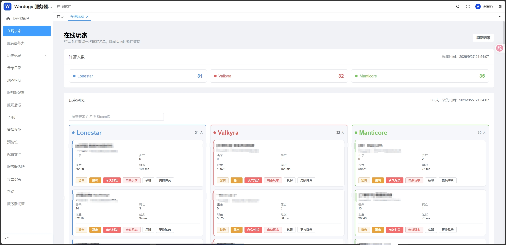
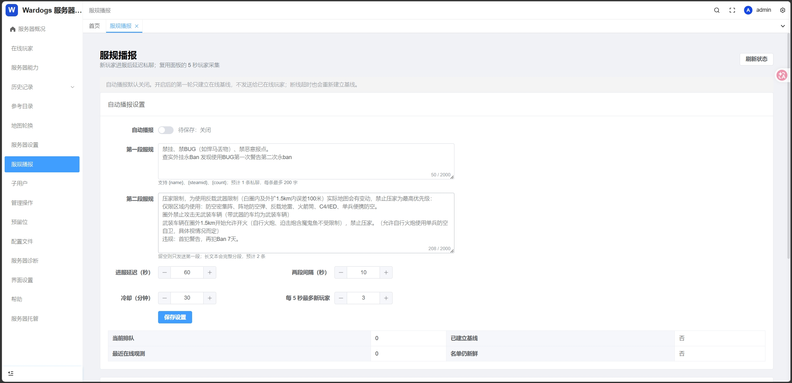
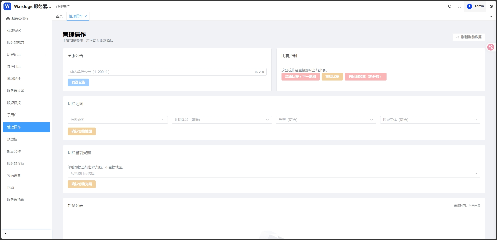

# Wardogs RCON Panel

[简体中文](README.md) | English

> ⚠️ **This project is still under development. Back up your server configuration and data before use, and verify write operations in a controlled environment.**

A self-hosted management panel for a Wardogs dedicated server. The frontend uses Vue 3, TypeScript, and Element Plus; the backend uses FastAPI and SQLite. The browser talks only to the panel API, while RCON credentials stay on the server.

> 💬 **Community:** WarDogs战狗 超级猫猫服务器社区群 · QQ group **1108826972**. Players and server administrators are welcome.

> This version manages one server. It calls the Wardogs HTTP RCON `/v1` routes and does not offer arbitrary console command execution.

## ✨ Features

- **Server and players:** View status, map, scores, and online players. Players are grouped by Lonestar, Valkyra, and Manticore; visible pages refresh about every five seconds.
- **Administration:** Kick, permanently ban and unban, kill a character, send private messages and warnings, change factions, broadcast, change maps or lighting, and end or restart a match. Available actions depend on the capabilities advertised by the server. Dangerous actions require confirmation.
- **Lists and reserved slots:** Read the ban and reserved-slot lists. Reservation reasons and expiry dates are stored only in the panel. The panel removes a reservation when it expires. An uncertain write stops automatic retries and requires manual review.
- **Warmup rewards:** Grant reserved slots only after a sustained population drop followed by a fresh threshold crossing, with both a daily limit and an hourly cooldown. Notifications are editable and support private messages or broadcasts. Longer existing reservations are preserved. Disabled by default.
- **Version updates:** Automatically check the latest GitHub Release after login. The navigation bar offers manual checks, the installed version, and release notes. Results are cached; administrators perform upgrades.
- **Configuration drafts:** Load the current server configuration before editing. Applying a draft requires validation and re-entry of the current account password. Editing a draft, saving a browser preset, and validating do not change the server configuration.
- **Official configuration API issue protection:** Some servers omit the ban array from `/v1/config`. The panel cross-checks `/v1/bans`. A mismatch or failed verification disables configuration editing, validation, download and application, and blocks related whole-document writes from reserved slots and warmup rewards. Missing configuration lines are never synthesized.
- **Team and history:** Create subusers, generate random passwords, and grant individual permissions; new subusers are read-only by default. The panel samples player and match history and can privately send server rules, with local delivery records. Automatic rule announcements are disabled by default.

Match history is derived from periodic snapshots. Brief connections or events between samples may be missed, and earlier history cannot be reconstructed.

## 🖼️ Screenshots

These screenshots were captured during development; the interface may change. Player names and Steam IDs in the online-player screenshot were blurred in the original image.

**Online players in three factions**



**Server rules announcements**



**Administration**



## 🚀 Run locally

You need Python 3.11+, Node.js, and pnpm 9. Run these commands in PowerShell from the directory where you want to clone the repository:

```powershell
git clone https://github.com/TreasureGooldove/Wardogs_RCON_PANEL.git
Set-Location Wardogs_RCON_PANEL\backend
python -m venv .venv
.\.venv\Scripts\python.exe -m pip install -e '.[dev]'
$env:PANEL_PUBLIC_ORIGIN = 'http://127.0.0.1:8848'
.\.venv\Scripts\python.exe -m app.cli create-admin
.\.venv\Scripts\python.exe -m uvicorn app.main:app --host 127.0.0.1 --port 8000
```

In another PowerShell window, from the same parent directory:

```powershell
Set-Location Wardogs_RCON_PANEL\frontend
pnpm install --frozen-lockfile
pnpm dev
```

Open `http://127.0.0.1:8848`. To use read-only mock data first, set `WARDOGS_RCON_ORIGIN=http://127.0.0.1:18765`, `WARDOGS_RCON_BEARER=local-mock-only`, and `WARDOGS_ALLOW_PRIVATE_HTTP=true` in the backend PowerShell window before starting it. Run `python -m tests.mock_rcon` from `backend/` in a separate window. These values are only for the local mock.

Set a persistent Fernet `PANEL_CONFIG_KEY` in the backend environment before saving a real server connection. See the [backend environment example](backend/.env.example) for key generation and other settings. Never commit a real Bearer, Steam Web API key, administrator password, or database. Copying `.env.example` alone does not load environment variables for local commands; Docker Compose uses the [deployment environment file](deploy/panel.env.example).

## 🌐 Languages

Supports Simplified Chinese, English, Japanese, and Korean. Switch languages on the login page, navigation bar, or Interface Settings; your choice is saved in the current browser.

All languages except Chinese are marked **AI translated** and provided for reference. Language packs are bundled locally, with no runtime translation requests. Server names, player names, SteamIDs, RCON identifiers, and user-edited broadcasts/rules remain unchanged. Save pending drafts before confirming a language switch, which reloads the interface.

## 🛠️ Deployment and checks

See [deployment guide](deploy/README.en.md) for the deployment template and steps. HTTP and HTTPS deployments are supported. HTTP displays a security warning before the login page. The guide covers HTTP configuration, automatic HTTPS certificates, and migration; HTTPS is recommended. Public plain HTTP RCON requires two explicit opt-ins and sends the privileged Bearer in cleartext; prefer HTTPS or a controlled private network.

```powershell
Set-Location backend
.\.venv\Scripts\python.exe -m pytest tests -q
Set-Location ..\frontend
pnpm run typecheck
pnpm run build
```

When players are online, limit live checks to necessary reads. Schedule kick, ban, warning, match control, and configuration write tests for a controlled maintenance window. RCON writes are not automatically retried after a timeout.

## 🙏 Credits and licenses

- [vue-pure-admin](https://github.com/pure-admin/vue-pure-admin) provides the upstream admin UI ecosystem. This project is adapted from its lightweight [pure-admin-thin](https://github.com/pure-admin/pure-admin-thin) variant. See [frontend/UPSTREAM.md](frontend/UPSTREAM.md) for the pinned source commit and [frontend/LICENSE](frontend/LICENSE) for its preserved MIT license.
- [Warcon](https://github.com/warcon-app/warcon) was a feature reference for Wardogs RCON administration, including history and team workflows. This panel is an independent implementation with a different frontend, backend, and storage model; its feature set does not claim parity with Warcon.

The repository root retains the original [Apache-2.0 license](LICENSE). The upstream frontend code also remains subject to its MIT license.
